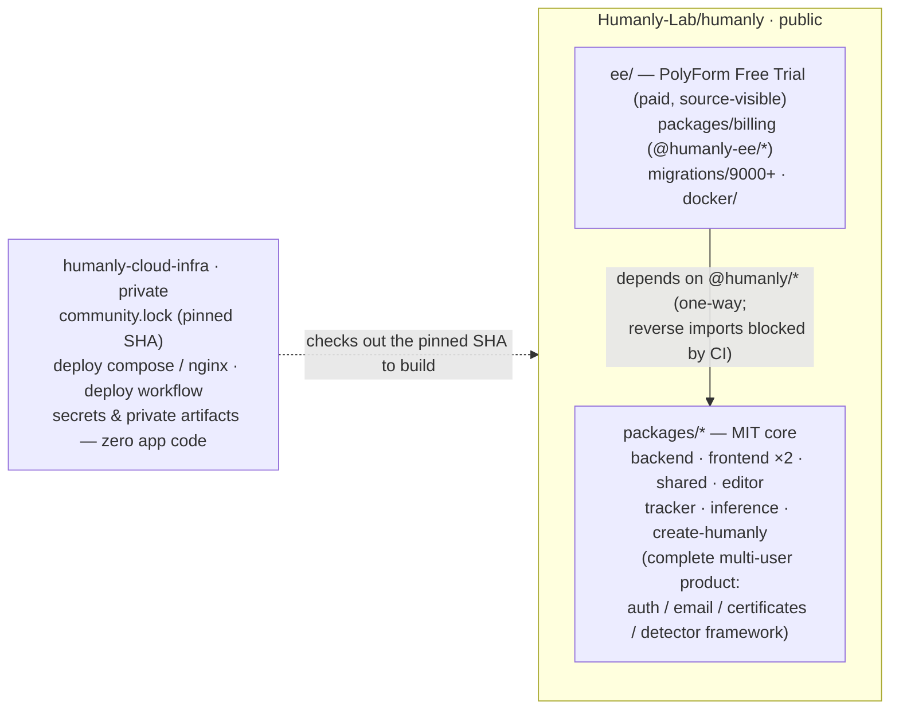
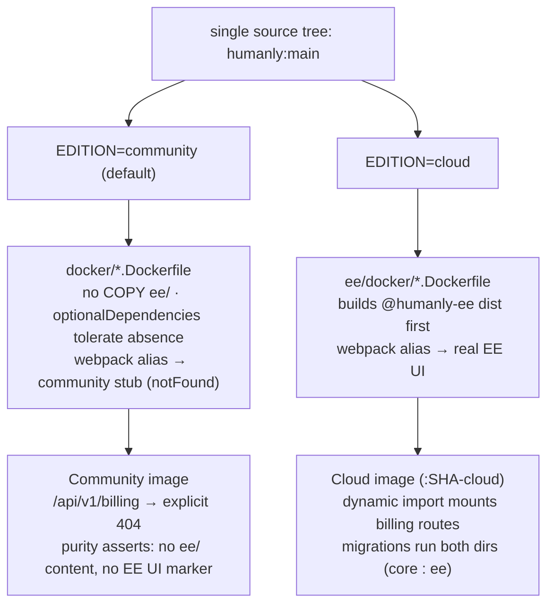
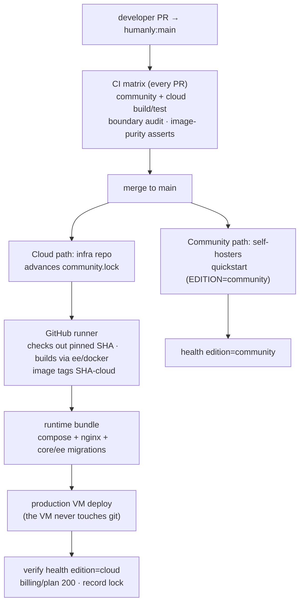

# Editions Development Guide (internal)

How to work with the Community/Cloud edition split day to day. Written for Humanly
team members and coding agents. This repo is public, so nothing secret belongs here;
operational runbooks and production config live in the private infra repo.

## Architecture at a glance

Repository topology and the Community/EE separation:



One source tree, two builds — the concrete seams:



End-to-end delivery workflow:



## Mental model: three boundaries, two repos

| Boundary | Question it answers | Where it lives |
|---|---|---|
| Code evolution | Does product code ever fork? | Never — all product code in this repo |
| Licensing | Who may use which code for free? | `packages/*` = MIT; `ee/` = PolyForm Free Trial 1.0.0 |
| Operations/secrets | What does our production look like? | Private infra repo (`humanly-cloud-infra`) — deployment only, zero app code |

**The edition boundary is a commercial-value boundary, not a deployment boundary.**
If something differs between self-host and our SaaS only by *configuration* (SMTP
provider, OAuth client IDs, hostnames, storage bucket), it is core code + env config —
not an `ee/` feature.

## The switch

- Backend: `EDITION=community|cloud` (default community), read once in
  `packages/backend/src/config/env.ts`.
- Frontends: `NEXT_PUBLIC_EDITION`, normalized in each app's `src/lib/edition.ts`.
- Registry: `packages/shared/src/config/edition.ts` — `Edition`, `EditionFeature`,
  `hasFeature(edition, feature)`. **All gating goes through `hasFeature`**; never
  scatter raw `process.env.EDITION` checks (the only exceptions are literal
  `process.env.NEXT_PUBLIC_EDITION === 'cloud'` comparisons at frontend branch sites,
  which Next.js needs for dead-code elimination).

## Where things live

```
packages/*          MIT core. The complete, working multi-user product.
ee/packages/*       Paid features (@humanly-ee/*). May import @humanly/*.
ee/migrations/      Cloud-only SQL (numbered 9000+).
ee/docker/          Cloud image compositions (EDITION=cloud).
```

Hard rule (CI-enforced by `scripts/ci/community-boundary.mjs`):
**`packages/*` never imports from `ee/`.** EE plugs into core through seams core
defines (dynamic-import registration, webpack alias), never the reverse.

## Recipe: add a new Cloud feature

Worked example — the billing skeleton (use it as the template):

1. **Flag** — add the name to `EditionFeature` and cloud's list in
   `packages/shared/src/config/edition.ts`.
2. **Package** — `ee/packages/<feature>/` with scope `@humanly-ee/<feature>`,
   `"license": "SEE LICENSE IN ../../LICENSE"`.
3. **Backend** — register behind the flag in `packages/backend/src/app.ts` using the
   existing dynamic-import pattern (`loadBillingModule` style: import via a variable
   so community builds never resolve the package). Return an explicit 404 for the
   route prefix in community.
4. **Frontend** — export UI from the ee package; resolve it through a build-time
   webpack alias in `next.config.js` that points at the ee source in cloud builds and
   a community stub otherwise (see `@humanly-edition/billing-ui`); add a runtime
   `notFound()` guard in the page.
5. **DB** — migration in `ee/migrations/` (9000+ prefix). Cloud deploys pass both
   dirs via colon-separated `MIGRATIONS_DIR`.

One PR. The CI matrix (community + cloud) plus the image-purity check
(`scripts/ci/assert-edition-image.sh`) prove community is untouched.

**If the feature must *change* core behavior** (not just add routes/pages): add an
extension point in core (provider interface + community default implementation) and
let the ee package register its implementation. Do not sprinkle `if (cloud)` through
core logic — edition awareness belongs only at registration sites.

## Frequently confused placements

| Thing | Placement | Why |
|---|---|---|
| Password reset, email sending | Core | Config-driven (`EMAIL_SERVICE=console\|sendgrid\|smtp`); self-hosters bring SMTP. Our SendGrid key is infra-repo config. |
| Google/GitHub login | Core | Credential-config-driven; `/auth/oauth/providers` hides unconfigured buttons. Self-hosters may bring their own client IDs. |
| Enterprise SSO (SAML/OIDC/SCIM) | Future `ee/` | The canonical open-core paid line (GitLab: OmniAuth free, SAML paid). |
| File storage (local/GCS) | Core | Adapter chosen by config; both editions may use either. |
| Plan/quota enforcement, team workspaces, cross-tenant analytics | `ee/` | Value exists only in a paid context. |
| Managed typing-detector model/weights | Infra repo / private bucket | Secret artifacts; `ee/` carries only the managed-client glue. |
| Detector framework, `packages/inference` | Core | Described by the paper; the OSS release must keep it (bring-your-own endpoint). |

Reference for the pattern, not the split: OpenHands puts auth/email/billing in
`enterprise/` because their OSS build is a **single-user local tool with no accounts**.
Humanly Community is a multi-user server — auth and email are core product here.

## Running each edition locally

```bash
# Community (default — everything as before)
npm run dev:backend / dev:frontend / dev:frontend-user

# Cloud
EDITION=cloud npm run dev:backend
NEXT_PUBLIC_EDITION=cloud npm run dev:frontend-user
MIGRATIONS_DIR="packages/backend/src/db/migrations:ee/migrations" scripts/run-migrations.sh
```

Health endpoint reports the running edition (`edition: "community" | "cloud"`).

## Invariants CI will hold you to

1. Typecheck + runnable tests pass for **both** editions (matrix).
2. No `packages/* → ee/` imports; no managed-production paths/hostnames in Community
   sources (`community-boundary.mjs`).
3. Community images contain no `ee/` content (`assert-edition-image.sh`).
4. Community must boot and pass tests with `ee/` absent.

When you change a seam (registry, alias, migration runner, CI scripts), update this
guide and `docs/EDITIONS_REFACTOR_PLAN.md` in the same PR.
